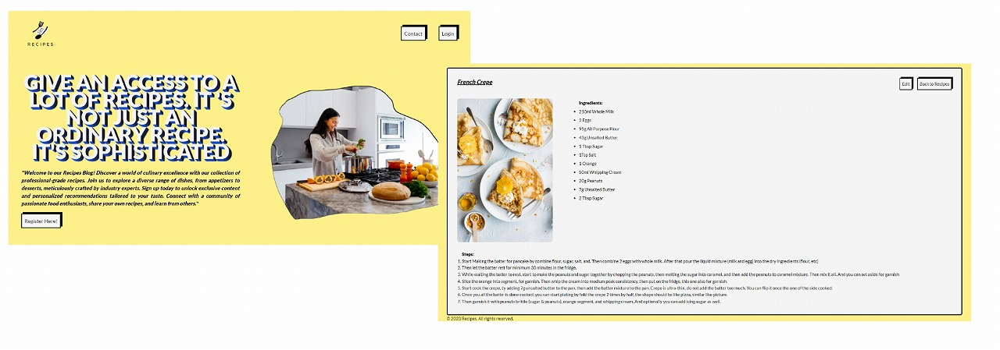

# Recipes Blog

### Background of the App

“Recipes come from the idea of a person with a several years of experience in the hospitality industry who shares their cooking knowledge. It begin from friends that gradually asking what’s the best recipe for some of the cuisine that they want to cook, then it turns like a habit. And recipes is here to make it easier for people who probably facing the same moments, then they can have a directly access to recipes. The result is a food recipe blog where users can share their recipes and access others' recipes.”

## Links

- Website: [Recipes](http://cookbookrecipes.blog/)
- Vercel: [Recipes](https://w22-group-react-group-b.vercel.app/)
- Figma: [Recipes](https://www.figma.com/file/md3JABO7RLkMCeaxWF81Xl/Recipes?type=design&node-id=0-1&mode=design&t=izF9RPcL20NRdlcu-0)
- GitHub: [Recipes](https://github.com/revou-fsse-1/w22-group-react-group-b)

## Contributors

---

| Name            | Role                                   |
| --------------- | -------------------------------------- |
| Rio Yulinanda   | UI UX & Frontend Developer             |
| Yanky Hermaawan | Frontend Developer & Backend Developer |

## Technologies

## Business Potential

- **Free**

Basically this app is free of charge, and can be used by everyone. However we have an paid option as well.

- **Paid**

We have paid option as well for those who want to access limited content. Like the recipe for a special or popular cuisine.

- **Partnership**

We will offer the partnership with the restaurants, coffee or other F&B business, where we can share their recipe to the users, in exchange of promoting their business in our app.
